# Diagrama de Clases - E-Bentos Frontend

## Descripción
Este diagrama representa la arquitectura del sistema E-Bentos a nivel de diseño detallado, incluyendo todas las entidades de dominio, servicios, stores y sus relaciones.

## Diagrama Mermaid

```mermaid
classDiagram
    %% ============================================
    %% ENTIDADES DE DOMINIO - USUARIOS
    %% ============================================
    
    class LoginCredentials {
        -string email
        -string contrasenha
    }
    
    class RegisterData {
        -string email
        -string contrasenha
        -string nombres
        -string apellidoPat
        -string apellidoMat
        -string DNI
        -Date fechaNacimiento
        -number telefono
        -string genero
        -string nombreRol
    }
    
    class User {
        -string id
        -LoginCredentials loginCreds
        -string rol
        +getId() string
        +getRol() string
    }
    
    class GestorLocal {
        -number usuarioId
        -string telefono
        -string email
        -string dni
        -string nombres
        -string apellidos
        -Usuario usuarioCreador
        -PuntoVenta puntoVenta
        +getUsuarioId() number
        +getPuntoVenta() PuntoVenta
    }
    
    class Productora {
        -number usuarioId
        -string ruc
        -string razonSocial
        -string nombreComercial
        -string email
        -string telefono
        +getUsuarioId() number
        +getRuc() string
    }
    
    %% ============================================
    %% ENTIDADES DE DOMINIO - UBICACIÓN
    %% ============================================
    
    class Departamento {
        -number departamentoId
        -string nombre
        +getDepartamentoId() number
        +getNombre() string
    }
    
    class Provincia {
        -number provinciaId
        -string nombre
        -Departamento departamento
        +getProvinciaId() number
        +getDepartamento() Departamento
    }
    
    class Distrito {
        -number distritoId
        -string nombre
        -Provincia provincia
        +getDistritoId() number
        +getProvincia() Provincia
    }
    
    %% ============================================
    %% ENTIDADES DE DOMINIO - LOCALES Y VENTAS
    %% ============================================
    
    class PuntoVenta {
        -number puntoventaId
        -string nombre
        -string direccion
        -Distrito distrito
        -boolean activo
        +getPuntoVentaId() number
        +isActivo() boolean
        +getDistrito() Distrito
    }
    
    class Local {
        -number localId
        -string nombre
        -string direccion
        -string foto
        -number aforo
        -string tipoLocal
        -number activo
        -Usuario gestor
        -Distrito distrito
        +getLocalId() number
        +getAforo() number
        +getGestor() Usuario
        +getDistrito() Distrito
    }
    
    class FormDataLocal {
        -string nombre
        -string direccion
        -string foto
        -File fotoFile
        -number aforo
        -string tipoLocal
        -number gestorId
        -number distritoId
        +validate() boolean
        +toJSON() object
    }
    
    class FormDataLocalUpdate {
        -number localId
        -string nombre
        -string direccion
        -string foto
        -File fotoFile
        -number aforo
        -string tipoLocal
        -Distrito distrito
        +validate() boolean
        +toJSON() object
    }
    
    %% ============================================
    %% ENTIDADES DE DOMINIO - EVENTOS
    %% ============================================
    
    class Evento {
        -number eventoId
        -string nombreLocal
        -string nombreCategoria
        -string departamentoLocal
        -string nombreEvento
        -string fecha
        -number zonaDeMenorPrecio
        -number costoTotal
        -number visitas
        -string posterHorizontal
        -string posterVertical
        -number porcentajeVendido
        -number popularidad
        +getEventoId() number
        +getPopularidad() number
        +getPorcentajeVendido() number
    }
    
    class EventoDisponible {
        -number eventoId
        -string nombre
        +getEventoId() number
        +getNombre() string
    }
    
    class MetaProductora {
        -number metaId
        -number eventoId
        -number metaIngresos
        -number tasaConversion
        -number ticketsObjetivo
        -number activo
        -string nombreEvento
        -string fechaHorarioInicio
        -number entradasVendidas
        -number montoTotalRecaudado
        -number visitas
        +getMetaId() number
        +getTasaConversion() number
        +getEntradasVendidas() number
        +getMontoTotalRecaudado() number
    }
    
    class MetaRequest {
        -Evento evento
        -number metaIngresos
        -number tasaConversion
        -number ticketsObjetivo
        -number activo
        +toJSON() object
        +validate() boolean
    }
    
    %% ============================================
    %% ENTIDADES DE DOMINIO - REPORTES
    %% ============================================
    
    class ReporteLocal {
        -number localId
        -string nombreLocal
        -number totalEventos
        -number totalVentas
        -number ingresos
        +getLocalId() number
        +getTotalVentas() number
    }
    
    %% ============================================
    %% SERVICIOS
    %% ============================================
    
    class AuthService {
        -axios apiLog
        +login(credentials: LoginCredentials) Promise~AuthResponse~
        +getUser() Promise~User~
        -handleError(error: any) Error
    }
    
    class RegisterService {
        +register(data: RegisterData) Promise~number~
    }
    
    class GestorLocalService {
        +listarGestoresLocales() Promise~GestorLocal[]~
        +listarTaquilleros() Promise~GestorLocal[]~
        +listarOrganizadores(page: number, limit: number, nombreRol: string, buscador: string) Promise~GestorLocal[]~
        +listarDuenhos(page: number, limit: number, nombreRol: string, buscador: string) Promise~GestorLocal[]~
        +actualizarGestorLocal(id: number, payload: Partial~GestorLocal~) Promise~GestorLocal~
        +actualizarTaquillero(id: number, payload: Partial~GestorLocal~) Promise~GestorLocal~
        +actualizarOrganizador(id: number, payload: Partial~GestorLocal~) Promise~GestorLocal~
    }
    
    class ProductoraService {
        +listarProductoras() Promise~Productora[]~
        +listarProductorasPaginado(page: number, limit: number, buscador: string) Promise~Productora[]~
        +actualizarProductora(id: number, payload: Partial~Productora~) Promise~Productora~
        +registrarProductora(payload: Partial~Productora~) Promise~Productora~
        +eliminarProductora(id: number) Promise~void~
    }
    
    class LocalService {
        +getLocales() Promise~Local[]~
        +agregarLocal(data: FormDataLocal) Promise~Local~
        +editarLocal(dataUpdate: FormDataLocalUpdate) Promise~Local~
        +eliminarLocal(idLocal: number) Promise~void~
        +uploadImage(data: FormDataLocal|FormDataLocalUpdate) Promise~string~
    }
    
    class EventService {
        +listarEventos(idCategoria?: number) Promise~Evento[]~
    }
    
    class PuntoVentaService {
        +listarPuntosVenta() Promise~PuntoVenta[]~
        +listarPuntoVentaXId(id: number) Promise~PuntoVenta~
        +actualizarPuntoVenta(id: number, payload: Partial~PuntoVenta~) Promise~PuntoVenta~
        +registrarPuntoVenta(payload: Partial~PuntoVenta~) Promise~PuntoVenta~
        +eliminarPuntoVenta(id: number) Promise~void~
    }
    
    class UbicacionService {
        +listarDepartamentos() Promise~Departamento[]~
        +listarProvincias() Promise~Provincia[]~
        +listarDistritos() Promise~Distrito[]~
    }
    
    class GoalService {
        +listarMetasProductora() Promise~MetaProductora[]~
        +listarEventosDisponibles() Promise~EventoDisponible[]~
        +crearMeta(data: MetaRequest) Promise~MetaProductora~
        +editarMeta(metaId: number, data: MetaRequest) Promise~MetaProductora~
        +eliminarMeta(metaId: number) Promise~void~
    }
    
    class ReporteLocalService {
        +getReporteLocales() Promise~ReporteLocal[]~
    }
    
    class ForgetPassService {
        +forgetPassService(email: string) Promise~Response~
    }
    
    class NewPassService {
        +newPassService(email: string, codigo: string, nuevaContrasenha: string) Promise~number~
    }
    
    class LogoutService {
        +logoutService() Promise~number~
    }
    
    class DataService {
        +useGetProductora(id: number) Promise~Productora~
        +useGetGestor(id: number) Promise~GestorLocal~
    }
    
    %% ============================================
    %% STORES (STATE MANAGEMENT)
    %% ============================================
    
    class AuthStore {
        -User user
        -boolean isLoggedIn
        -string displayName
        +login(loginCreds: LoginCredentials) Promise~string~
        +logout() void
        +setUser(user: User) void
        +setDisplayName(name: string) void
    }
    
    class EventosStore {
        -Evento[] events
        -Evento[] filteredEvents
        -string category
        -string sortBy
        -string searchTerm
        +loadEvents() Promise~void~
        +setCategory(category: string) void
        +setSortBy(sortBy: string) void
        +setSearchTerm(searchTerm: string) void
        +clear() void
        -applyFilters(events: Evento[], category: string, searchTerm: string) Evento[]
        -sortByType(events: Evento[], sortBy: string) Evento[]
    }
    
    class ResetPassStore {
        -string email
        -string codigo
        -string nuevaContrasenha
        +setEmail(email: string) void
        +setCodigo(codigo: string) void
        +setNuevaContrasenha(nuevaContrasenha: string) void
        +clear() void
    }
    
    %% ============================================
    %% RELACIONES
    %% ============================================
    
    %% Relaciones de Ubicación
    Provincia "1" --> "1" Departamento : contiene
    Distrito "1" --> "1" Provincia : pertenece a
    PuntoVenta "1" --> "1" Distrito : ubicado en
    Local "1" --> "1" Distrito : ubicado en
    
    %% Relaciones de Usuarios
    GestorLocal "1" --> "0..1" PuntoVenta : gestiona
    GestorLocal "1" --> "1" User : es un
    Local "1" --> "1" GestorLocal : administrado por
    Productora "1" --> "1" User : es un
    
    %% Relaciones de Eventos
    MetaProductora "1" --> "1" Evento : define meta para
    Evento "1" --> "1" Local : se realiza en
    
    %% Relaciones de Formularios
    FormDataLocal ..> Local : crea
    FormDataLocalUpdate ..> Local : actualiza
    
    %% Relaciones de Servicios con Entidades
    AuthService ..> LoginCredentials : usa
    AuthService ..> User : retorna
    RegisterService ..> RegisterData : usa
    GestorLocalService ..> GestorLocal : gestiona
    ProductoraService ..> Productora : gestiona
    LocalService ..> Local : gestiona
    LocalService ..> FormDataLocal : usa
    LocalService ..> FormDataLocalUpdate : usa
    EventService ..> Evento : gestiona
    PuntoVentaService ..> PuntoVenta : gestiona
    UbicacionService ..> Departamento : gestiona
    UbicacionService ..> Provincia : gestiona
    UbicacionService ..> Distrito : gestiona
    GoalService ..> MetaProductora : gestiona
    GoalService ..> EventoDisponible : gestiona
    GoalService ..> MetaRequest : usa
    ReporteLocalService ..> ReporteLocal : gestiona
    DataService ..> Productora : obtiene
    DataService ..> GestorLocal : obtiene
    
    %% Relaciones de Stores con Servicios
    AuthStore --> AuthService : utiliza
    AuthStore --> LogoutService : utiliza
    AuthStore --> User : almacena
    EventosStore --> EventService : utiliza
    EventosStore --> Evento : almacena
    ResetPassStore --> ForgetPassService : utiliza
    ResetPassStore --> NewPassService : utiliza
    
    %% Relaciones de autenticación
    User --> LoginCredentials : contiene
    RegisterData ..> User : registra
    
    %% Relaciones de Metas
    MetaRequest --> Evento : referencia
    MetaProductora ..> MetaRequest : creada desde
```

## Leyenda

### Tipos de Relaciones
- `-->` : Asociación/Composición (una clase contiene o usa otra)
- `..>` : Dependencia (una clase depende de otra temporalmente)
- `"1"` : Cardinalidad uno
- `"0..1"` : Cardinalidad cero o uno
- `"*"` : Cardinalidad muchos

### Visibilidad de Atributos y Métodos
- `-` : Privado
- `+` : Público
- `#` : Protegido

### Categorías de Clases
1. **Entidades de Dominio - Usuarios**: LoginCredentials, RegisterData, User, GestorLocal, Productora
2. **Entidades de Dominio - Ubicación**: Departamento, Provincia, Distrito
3. **Entidades de Dominio - Locales y Ventas**: PuntoVenta, Local, FormDataLocal, FormDataLocalUpdate
4. **Entidades de Dominio - Eventos**: Evento, EventoDisponible, MetaProductora, MetaRequest
5. **Entidades de Dominio - Reportes**: ReporteLocal
6. **Servicios**: AuthService, RegisterService, GestorLocalService, ProductoraService, LocalService, EventService, PuntoVentaService, UbicacionService, GoalService, ReporteLocalService, ForgetPassService, NewPassService, LogoutService, DataService (14 servicios)
7. **Stores**: AuthStore, EventosStore, ResetPassStore (3 stores de gestión de estado)

## Resumen de Componentes

### Entidades de Dominio (17 clases)
- **Usuarios y Autenticación**: 5 clases
- **Ubicación Geográfica**: 3 clases
- **Locales y Puntos de Venta**: 4 clases
- **Eventos y Metas**: 4 clases
- **Reportes**: 1 clase

### Capa de Servicios (14 servicios)
- **Autenticación y Usuario**: AuthService, RegisterService, LogoutService, ForgetPassService, NewPassService
- **Gestión de Entidades**: GestorLocalService, ProductoraService, LocalService, PuntoVentaService
- **Eventos y Metas**: EventService, GoalService
- **Ubicación**: UbicacionService
- **Reportes**: ReporteLocalService
- **Utilidades**: DataService

### Gestión de Estado (3 stores)
- **AuthStore**: Manejo de sesión y autenticación del usuario
- **EventosStore**: Gestión de eventos, filtros y búsqueda
- **ResetPassStore**: Flujo de recuperación de contraseña

## Notas de Implementación

- Los servicios utilizan `axios` para comunicación HTTP con el backend
- Los stores utilizan `zustand` para gestión de estado
- La persistencia se implementa mediante `zustand/middleware/persist` en AuthStore y EventosStore
- Todas las operaciones asíncronas retornan `Promise`
- LocalService incluye integración con Azure Blob Storage para la carga de imágenes
- UbicacionService proporciona datos jerárquicos de ubicación (Departamento → Provincia → Distrito)
- GoalService maneja el CRUD completo de metas de productoras
- ResetPassStore coordina el flujo completo de recuperación de contraseña (solicitud → verificación → reset)
